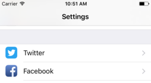
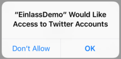

# Einlass
### One click user authentication solution via iOS social media system accounts. (Twitter & Facebook)

Einlass aims to be the easiest solution to authenticate users via their social network accounts. Einlass does not ask the user to re-enter their login credentials. Instead Einlass performs what is called a *reverse authentication* via the iOS integrated social media accounts, which results in a simpler and faster authentication flow. 

A low inhibition threshold for user account creation could also be considered a huge benefit from a user interactivity standpoint, since the user is not forced to enter any personal information into any suspicious web-views which is the normal login flow with most other authentication providing frameworks.

Einlass is written in Swift 3, has a very small dependency footprint, extensive error handling capabilities and is easy to integrate via [Cocoa Pods](https://cocoapods.org/) or the [Swift Package Manager](https://swift.org/package-manager/).


## Result Values

#### Facebook

- [User Access Token](https://developers.facebook.com/docs/facebook-login/access-tokens#usertokens)
- FBID aka Facebook user ID
- Real name
- Avatar URL
- Maybe an e-mail address

If the **User Access Token** is intended to be used for further calls to Facebooks [Graph API](https://developers.facebook.com/docs/graph-api), *permissions* and *target audience* can be configured prior to requesting the token.


#### Twitter

- OAuth 1.0a user [Access Token](https://dev.twitter.com/oauth/overview) (consist of **key** & **secret**)
- Twitter user ID
- Twitter @-name
- Twitter screen name
- Avatar URL
- Maybe an e-mail address 

The Twitter account credentials can then also be used to make further calls to the Twitter API on behalf of the user. 

#### Notes
Every mayor web stack has a variety of extensions to choose from, that can verify the authenticity of these tokens on the server side. Just search in your corresponding package manager.

The users e-mail address is an optional value, because on Twitter as well on Facebook, user can register only with a mobile telephone number. Also the Facebook token needs to have the right permissions set to access the e-mail address. Twitter as well needs very specific configuration on their app register page to access the users e-mail address, which includes among other things a link to your companies terms of service as well as a privacy policy. 

## Install

#### Cocoa Pods

To integrate Einlass into your project using CocoaPods, add it to your `Podfile`:

```ruby
target '<your_target_name>' do
    pod 'Einlass'
end
```

Then, run the following command:

```bash
$ pod install
```

You then will need to add `import Einlass` at the top of your swift source files.


#### Swift Package Manager

To integrate Einlass into your project using the swift package manager, add it as a dependency to your `Package.swift` file:

```swift
import PackageDescription

let package = Package(
    name: "<your_package_name>",
    dependencies: [
        .Package(url: "https://github.com/mw99/Einlass.git", majorVersion: 1)
    ]
)
```

You then will need to add `import Einlass` at the top of your swift source files.

## User Preconditions

- The user must have setup their valid social media accounts under **iOS Settings -> Twitter/Facebook** 



- The user must give your app permission to access the iOS system accounts. The user is presented with the regular permission request popup that is only shown **once**.



## Developer Preconditions

#### Twitter

- You have to register your app at [Twitter App Managment](https://apps.twitter.com/) to get the **consumer credentials (key & secret)**. You can find them under "Keys and Access Tokens".

**NOTE:** It is recommended to set your app permissions to **Read Only** if you will use the users credentials only for the purpose of authentication.

#### Facebook

- You have to register your app at [Facebook App Management](https://developers.facebook.com/apps) to get the **Facebook App ID** from facebook.
- It is also essential to set your app up as an iOS application with the correct **bundle identifier** under [app management](https://developers.facebook.com/apps).


#### Initialization

- If you install via Cocoa Pods or the Swift Package Manager, place `import Einlass` at the top of your source files.

- The previously obtained **Twitter consumer credentials** and **Facebook App ID** have to be passed to Einlass at app initialization. Create a new struct for constant values or use the one you have already set up, and make it conform to `FacebookConsumerCredentialProvider` and/or `TwitterConsumerCredentialProvider` respectively.

```swift
struct Constants: FacebookConsumerCredentialProvider, TwitterConsumerCredentialProvider {
    static let FACEBOOK_APP_ID         = "999999999999999"
    static let TWITTER_CONSUMER_KEY    = "ZZZZZZZZZZZZZZZZZZZZZZZZZ"
    static let TWITTER_CONSUMER_SECRET = "ZZZZZZZZZZZZZZZZZZZZZZZZZZZZ"
    // ... maybe other constant values your app depends on ...
}
```

Then at app initialization in `AppDelegate:didFinishLaunchingWithOptions` you pass them to `FacebookAuthenticator` and/or `TwitterAuthenticator`.

```swift
func application(_ application: UIApplication, didFinishLaunchingWithOptions: [UIApplicationLaunchOptionsKey: Any]?) -> Bool {
    FacebookAuthenticator.consumerCredentialProvider = Constants.self
    TwitterAuthenticator.consumerCredentialProvider  = Constants.self
    // ...
}
```

## Usage Example

It is recommended to try out the [Demo App](DemoApp). You will need to setup the consumer credentials as described previously in [AppDelegate.swift](DemoApp/EinlassDemo/AppDelegate.swift). A complete example also describing various error states can be found in [SNSAuthController.swift](DemoApp/EinlassDemo/SNSAuthController.swift).

### Twitter

To start a Twitter authentication procedure, create a **new** instance of `TwitterAuthenticator`, pass a `TwitterAuthenticatorDelegate` to it, and call `.perform()` on it. Also a good time to start an activity indicator now.

```swift
let twAuthenticator = TwitterAuthenticator()
twAuthenticator.delegate = self
twAuthenticator.perform()
```

Do not call `.perform()` on the same `TwitterAuthenticator` twice. Always create a new instance. So it would be better to not make it a class property. The delegate must conform to the `TwitterAuthenticatorDelegate` protocol, which consist of the following 3 methods:


--
##### `twitterAccountSelection:withAccounts:choice:`


This callback should initiate the presentation of a user interface that will let the user select one out of multiple Twitter accounts. Assumed `self` is of type `UIViewController`, one way to implement this would be with an action sheet selection popup:

```swift
func twitterAccountSelection(withAccounts accounts: [String], choice: @escaping (String?)->())
{
    let alert = UIAlertController(title: nil, message: nil, preferredStyle: .actionSheet)
    for acc in accounts {
        alert.addAction(UIAlertAction(title: acc, style: .default, handler: { _ in choice(acc) } ))
    }
    alert.addAction(UIAlertAction(title: "Cancel", style: .cancel, handler: { _ in choice(nil) } ))
    self.present(alert, animated: true)
}
```

--
##### `twitterAuthenticatorFinished:withCredentials:`

Is called upon a successful authentication flow. Here you may pass the received credentials to your backend for verification. Example:

```swift
func twitterAuthenticatorFinished(withCredentials credentials: TwitterAuthenticator.Credentials) {
    let msg: [String] = [
        "Twitter reverse authentication successful! Credentials:",
        "TWID: \(credentials.id)",
        "Name: \(credentials.name)",
        "Screen Name: \(credentials.screenName)",
        "Key: \(credentials.key)",
        "Secret: \(credentials.secret)",
        "E-Mail: \(credentials.email ?? "nil")",
        "Avatar URL: \(credentials.avatar)"
    ]
    print(msg.joined(separator: "\n"))
}
```

--
##### `twitterAuthenticatorFinished:withProblem:`

Is called when the authentication flow encountered a problem and can't continue. An enum of type `TwitterAuthenticator.Problem` is passed to the method describing the error.

| Problem indicating enum | Explanation |
| :---         |     :---:      |
| `noSystemTwitterAccount` | Occurs when no Twitter system account is registered under iOS settings. |
| `twitterAccountAccessNotGranted` | Occurs when the user did not grant access permission to the iOS system Twitter account. |
| `userCanceledAccountSelection` | Occurs when the callback passed to `twitterAccountSelection:withAccounts` was called with `nil`. |
| `twitterAccountBanned` | Occurs when you have an account setup under iOS settings that has been banned by Twitter. Happens quite often with test accounts. |
| `twitterAuthenticatorUnconfigured` | Occurs when `consumerCredentialProvider` was not set during app initialization. |
| `networkFailure(Int, String)` | General error for networking problems. Contains a code belonging to `NSURLErrorDomain` and a debug message. |
| `twitterFailure(String)` | General error for unrecoverable Twitter server-side failures. Contains a debug string explaining the error. |
| `accountStoreFailure(String)`   | General error for unrecoverable iOS account store failures. Contains a debug string explaining the error. |


**Note**: You may want to open the Twitter account settings with: `UIApplication.shared.open(URL(string:"App-Prefs:root=TWITTER")!)` since permission popups are only shown once or let the user setup an initial account.

**Note**: To save time you may copy & paste parts from the [demo application](DemoApp/EinlassDemo/SNSAuthController.swift).


### Facebook

To start a Facebook authentication procedure, create a **new** instance of `FacebookAuthenticator`, pass a `FacebookAuthenticatorDelegate` to it. You may want to modify the **permissions** and **target audience** that will be tied to the token. A complete list of all **permissions** can be found in the [Facebook Graph API documentation](https://developers.facebook.com/docs/facebook-login/permissions). The default permissions are:

- user_birthday
- user_location
- user_friends
- email
- public_profile

Finally call `.perform()` to start the authentication procedure. Also a good time to start an activity indicator.

```swift
let fbAuthenticator = FacebookAuthenticator()
fbAuthenticator.delegate = self
fbAuthenticator.permissions = ["public_profile", "email"]
fbAuthenticator.audience = .onlyMe
fbAuthenticator.perform()
```

Do not call `.perform()` on the same `FacebookAuthenticator` twice. Always create a new instance. So it would be better to not make it a class property. The delegate must conform to the `FacebookAuthenticatorDelegate` protocol, which consist of the following 3 methods:


--
##### `facebookAccountConfirmation:withAccount:proceed:`


This callback should initiate the presentation of a user interface that will let the user confirm that he/she wants to login with that user account. The username is passed as a parameter. Unlike Twitter, only one Facebook account is allowed to be register under iOS settings. Assumed `self` is of type `UIViewController`, one way to implement this would be with an action sheet selection popup:

```swift
func facebookAccountConfirmation(withAccount account: String, proceed: @escaping (Bool)->())
{
    let alert = UIAlertController(title: nil, message: nil, preferredStyle: .actionSheet)
    alert.addAction(UIAlertAction(title: account, style: .default, handler: { _ in proceed(true) } ))
    alert.addAction(UIAlertAction(title: "Cancel", style: .cancel, handler: { _ in proceed(false) } ))
    self.present(alert, animated: true)
}
```

--
##### `facebookAuthenticatorFinished:withCredentials:`

Is called upon a successful authentication flow. Here you may pass the received credentials to your backend for verification. Example:

```swift
func facebookAuthenticatorFinished(withCredentials credentials: FacebookAuthenticator.Credentials)
{   
    let msg: [String] = [
        "Facebook reverse authentication successful! Credentials:",
        "FBID: \(credentials.id)",
        "Name: \(credentials.name)",
        "Token: \(credentials.token)",
        "E-Mail: \(credentials.email ?? "nil")",
        "Avatar URL: \(credentials.avatar)"
    ]
    print(msg.joined(separator: "\n"))
}
```

--
##### `facebookAuthenticatorFinished:withProblem:`

Is called when the authentication flow encountered a problem and can't continue. An enum of type `FacebookAuthenticator.Problem` is passed to the method describing the error.

| Problem indicating enum | Explanation |
| :---         |     :---:      |
| `noSystemFacebookAccount` | Occurs when no Facebook system account is registered under iOS settings. |
| `facebookAccountAccessNotGranted` | Occurs when the user did not grant access permission to the iOS system Facebook account. |
| `userCanceledAccountSelection` | Occurs when the `proceed(Bool)` callback passed to `facebookAccountConfirmation:withAccount` was called with `false`. |
| `systemAccountReloginNeeded` | Occurs when the Facebook system account is not valid anymore. When the user changes his/her password or gets banned on facebook would be examples for that. |
| `facebookAuthenticatorUnconfigured` | Occurs when `consumerCredentialProvider` was not set during app initialization. |
| `networkFailure(Int, String)` | General error for networking problems. Contains a code belonging to `NSURLErrorDomain` and a debug message. |
| `facebookFailure(String)` | General error for unrecoverable Facebook server-side failures. Contains a debug string explaining the error. |
| `accountStoreFailure(String)`   | General error for unrecoverable iOS account store failures. Contains a debug string explaining the error. |


**Note**: You may want to open the Facebook account settings with: `UIApplication.shared.open(URL(string:"App-Prefs:root=FACEBOOK")!)` since permission popups are only shown once or let the user setup an initial account.

**Note**: To save time you may copy & paste parts from the [demo application](DemoApp/EinlassDemo/SNSAuthController.swift).


## Server Side Token Verification

As stated earlier, regarding server side token validation, every mayor web-stack  has a variety of extensions for to choose from. However, it is actually quite easy to implement the credential validation yourself.

#### Facebook

Facebook user credential validation can be performed via their [Graph API](https://developers.facebook.com/docs/graph-api/). First you would call the [`/debug_token`](https://developers.facebook.com/docs/graph-api/reference/v2.9/debug_token) endpoint to verify that the token is valid and was created by your app, then you may proceed with the [`/me`](https://developers.facebook.com/docs/graph-api/reference/user) endpoint to access more of the users data, like the users e-mail address.

#### Twitter

Twitter user credential validation is slightly more complicated since requests to the [Twitter API](https://dev.twitter.com/overview/api) have to be signed with [OAuth](https://dev.twitter.com/oauth). Because of that it is highly recommended to use an already available extension for your web-stack that will allow you to perform OAuth requests. The users credentials (key & secret) can be verified with the [/account/verify_credentials](https://dev.twitter.com/rest/reference/get/account/verify_credentials) endpoint.

## Furthermore

#### Contribute

Contributions and bug reports are always welcome. Especially because there could still be some corner cases left for weird but recoverable errors since accounts 

#### Implementation of other Authentication Services

Einlass can only support iOS integrated authentication providers, which are at the time of writing this: Facebook, Twitter, Vimeo, Flickr, Sina Weibo and Tencent Weibo. Beyond that, since it is not part of any standart, not all of them seem to support *reverse authentication*. Sina Weibo for example does not. 

#### The meaning of *"Einlass"*?

[That](https://www.google.com/search?tbm=isch&q=einlass) is an Einlass :)


## License

[Einlass](https://github.com/mw99/Einlass) was created by [Markus Wanke](https://github.com/mw99) and is released under the [Apache 2.0 Licence](http://www.apache.org/licenses/LICENSE-2.0).

